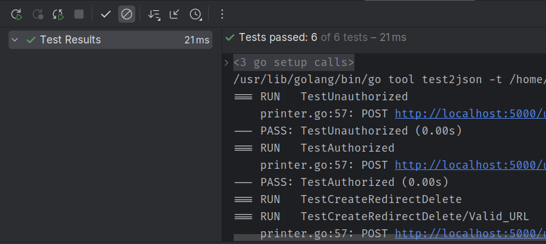

### Description:
Rest API for shortening urls

## Self-hosting instructions:
1. Clone the repository
2. Install dependencies
    ```shell
    go mod download
    ```
3. Run the server
    ```shell
    make run
    ```
4. Run the tests
  ```shell
  make tests
  ```
Save alias
- `POST /`
  ```json
    {
      "url": "https://www.google.com",
      "alias": "google"
    }
  ```
Delete alias
- `DELETE /:alias`

Go to the shortcut link
- `GET /:alias`

## Features:
- Redirect to the original url by the short url
- If alias is not provided, generate a random alias
- Creating, deleting urls are protected by auth
  - basic http auth
- To store data use sqlite database
- Api tries to decode json body, if it fails, returns `failed to parse request` message
- Validates incoming requests
- Logs all requests in text format in dev environment, and in json format in prod environment
- Saving existing url, returns the same name message
- Fails if alias is invalid
- Fails if URL for given alias not found
- Redirect only if successfully got URL


Tests shows that api works correctly