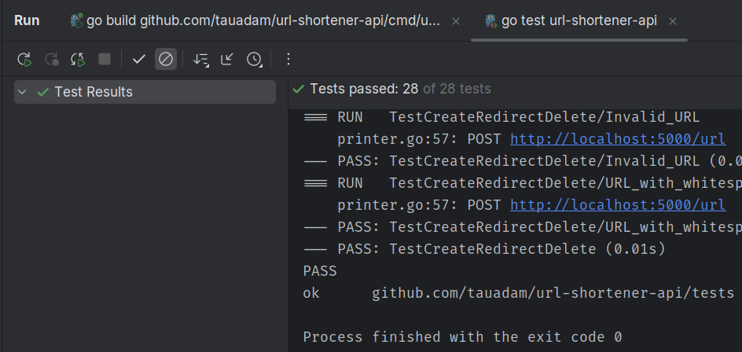

# Url Shortener
### Description:
Rest API for shortening urls

## Features:
- Redirect to the original url by the short url
- If alias is not provided, generate a random alias
- Creating, deleting urls are protected by auth
  - basic http auth
- To store data use sqlite database

Tests shows that api works correctly